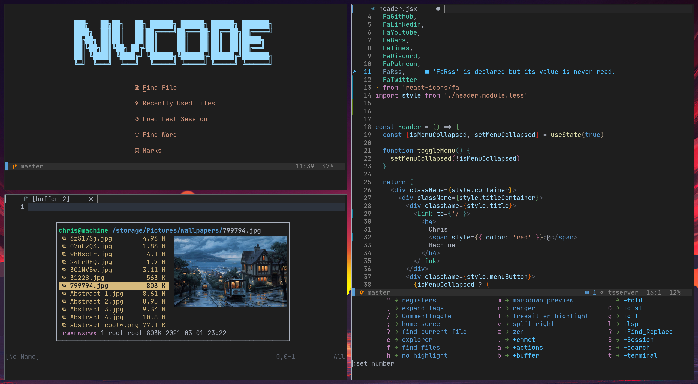

```
   _..._                             
 .'   (_`.    _                         __     ___           
:  .      :  | |   _   _ _ __   __ _ _ _\ \   / (_)_ __ ___  
:)    ()  :  | |  | | | | '_ \ / _` | '__\ \ / /| | '_ ` _ \ 
`.   .   .'  | |__| |_| | | | | (_| | |   \ V / | | | | | | |
  `-...-'    |_____\__,_|_| |_|\__,_|_|    \_/  |_|_| |_| |_|
```

[](https://github.com/ChristianChiarulli/LunarVim/blob/master/LICENSE)
[](https://github.com/ChristianChiarulli/lunarvim)
[](http://makeapullrequest.com)
<a href="https://patreon.com/chrisatmachine" title="Donate to this project using Patreon"></a>
<a href="https://twitter.com/intent/follow?screen_name=chrisatmachine"></a>



# Table of contents

- [What’s included?](#whats-included)
  * [Why do I want tree-sitter and LSP?](#why-do-i-want-tree-sitter-and-lsp)
- [Project Goals](#project-goals)
- [Install In One Command!](#install-in-one-command)
  * [Get the latest version of Neovim](#get-the-latest-version-of-neovim)
- [Getting started](#getting-started)
  * [Home screen](#home-screen)
  * [Leader and Whichkey](#leader-and-whichkey)
  * [Important Configuration files](#important-configuration-files)
- [Install your own plugins](#install-your-own-plugins)
  * [An example installation of the colorizer plugin](#an-example-installation-of-the-colorizer-plugin)
  * [Finding plugins](#finding-plugins)
- [Using Packer](#using-packer)
  * [Packer commands](#packer-commands)
  * [Packer reports missing plugins](#packer-reports-missing-plugins)
- [Clipboard Support](#clipboard-support)
- [LSP](#lsp)
  * [Lsp errors](#lsp-errors)
    + [Understanding LspInfo](#understanding-lspinfo)
    + [Example configurations](#example-configurations)
  * [Last resort](#last-resort)
- [Useful Programs](#useful-programs)
- [EFM server](#efm-server)
- [Formatters and Linters](#formatters-and-linters)
- [De-bugging](#de-bugging)
- [VSCodium](#vscodium)
- [Color Schemes](#color-schemes)
  * [Available colorschemes](#available-colorschemes)
  * [Switching colors](#switching-colors)
- [Useful commands for
  troubleshooting](#useful-commands-for-troubleshooting)
- [Uninstalling](#uninstalling)
- [TODO](#todo)

# What’s included?

LunarVim provides neovim configuration files that take advantage of
tree-sitter and language server protocol. The configuration is written
in lua.

## Why do I want tree-sitter and LSP?

- Normally, an editor uses regular expression parsing for things like
  highlighting and checking the syntax of your file. Each time you make
  a change, the editor must re-parse the entire file. Tree-sitter, on
  the other hand, transforms text into a syntax tree. Each time you make
  a change, only the parts of the code that change need to be parsed.
  This greatly improves the speed of parsing. This can make a huge
  difference when editing large files.

- Neovim 0.5 including language server protocol means your editor can
  provide: code actions, completions, formatting, navigating to
  definitions, renaming, etc. The language server only has to be written
  once and will work on any editor that supports LSP. Any improvements
  made to the language server will immediately be used by all editors
  that support LSP.

# Project Goals

- This project aims to help one transition away from VSCode, and into a
  superior text editing experience. (Just making this clear)

- This is also a community project, if you would like to see support for
  a feature or
  [language](https://github.com/neovim/nvim-lspconfig/blob/master/CONFIG.md)
  consider making a PR.

- This project will do it’s best to include core features you would
  expect from a modern IDE, while making it easy to add or remove what
  the user wants.

# Install In One Command!

Make sure you have the newest version of Neovim (0.5).

``` bash
bash <(curl -s https://raw.githubusercontent.com/ChristianChiarulli/lunarvim/master/utils/installer/install.sh)
```

After installation run `nvim` and then `:PackerInstall`

## Get the latest version of Neovim

Some operating systems package versions of Neovim 0.5. You can install
those or you can follow the steps below to compile from source.
Compiling from source is the recommended method.

First, get the dependencies. For distributions other than Ubuntu or Arch
go
[here](https://github.com/neovim/neovim/wiki/Building-Neovim#build-prerequisites)

``` bash
#Ubuntu
sudo apt-get install gettext libtool libtool-bin autoconf automake cmake g++ pkg-config unzip build-essential
#Arch
sudo pacman -S base-devel cmake unzip ninja tree-sitter
```

Download and compile Neovim

``` bash
cd $(mktemp -d)
git clone https://github.com/neovim/neovim --depth 1
cd neovim
sudo make CMAKE_BUILD_TYPE=Release install
cd ..
rm -rf neovim
```

or if you are on Arch you can get it from the AUR

``` bash
yay -S neovim-git
```

# Getting started

## Home screen

The home screen is a plugin called
[Dashboard](https://github.com/glepnir/dashboard-nvim). It uses the
[Telescope](https://github.com/nvim-telescope/telescope.nvim) plugin to
find files or find words within files. The home screen provides a link
to load saved Sessions. The home screen links to the settings file
located at this path: \~/.config/nvim/lv-settings.lua

## Leader and Whichkey

The default leader key is set to &lt;Space&gt;. Pressing it will also
open up [Whichkey](https://github.com/folke/which-key.nvim). Whichkey
will help you easily access many of the default keybindings. Whichkey
defines keymappings in this file:
\~/.config/nvim/lua/lv-which-key/init.lua

## Other key bindings

Other key bindings can be found in \~/.config/nvim/lua/keymappings.lua

If you already have a set of keybindings in vimscript that you prefer,
source your vimscript file from \~/.config/nvim/init.lua

Example:

``` lua
vim.cmd('source ~/.config/nvim/vimscript/keymappings.vim')
```

Or you can translate your old bindings to lua and keep them in the
provided keymappings file. Follow the lua guide available
[here](https://github.com/nanotee/nvim-lua-guide)

## Important Configuration files

| Path                                | Description                |
|-------------------------------------|----------------------------|
| \~/.config/nvim/lv-settings.lua     | The main settings file     |
| \~/.config/nvim/lua/keymappings.lua | Key bindings               |
| \~/.config/nvim/lua/plugins.lua     | Add or remove plugins here |

# Install your own plugins

The steps for configuring your own plugin are: 
1. Add the plugin to `plugins.lua`
2. If the plugin requires configuration, create a configuration file for it
3. If you created a configuration, require the file in `init.lua`
4. Use Packer to download and install the plugin

## An example installation of the colorizer plugin

- \~/.config/nvim/lua/plugins.lua

``` lua
use {"norcalli/nvim-colorizer.lua", opt = true}
require_plugin("nvim-colorizer.lua")
```

- \~/.config/nvim/lua/lv-colorizer/init.lua

``` lua
require'colorizer'.setup()
```

- \~/.config/nvim/init.lua

``` lua
require('lv-colorizer')
```

``` lua
:PackerCompile
:PackerInstall
```

## Finding plugins

If you want to find other plugins that take advantage of neovim’s latest
features go [here](https://github.com/rockerBOO/awesome-neovim)

# Using Packer

[Packer](https://github.com/wbthomason/packer.nvim) manages your
installed plugins. Any time you make changes to your list of plugins in
\~/.config/nvim/lua/plugins.lua you must first run the command
:PackerCompile then :PackerInstall. \#\# Packer commands

``` bash
-- You must run this or `PackerSync` whenever you make changes to your plugin configuration
:PackerCompile

-- Only install missing plugins
:PackerInstall

-- Update and install plugins
:PackerUpdate

-- Remove any disabled or unused plugins
:PackerClean

-- Performs `PackerClean` and then `PackerUpdate`
:PackerSync

-- View the status of your plugins
:PackerStatus
```

## Packer reports missing plugins

If you get an error message about missing plugins and the above commands
do not work, remove the plugin directory and reinstall from scratch.

``` bash
rm -rf ~/.local/share/nvim/site
:PackerCompile
:PackerInstall
```

# Clipboard Support

- On Mac `pbcopy` should be built-in

- Ubuntu

    ```bash
    sudo apt install xclip
    ```

- Arch

    ```bash
    sudo pacman -S xclip
    ```

- WSL2

    Make sure ~/bin is in your path in this case.

    ```bash
    curl -sLo/tmp/win32yank.zip https://github.com/equalsraf/win32yank/releases/download/v0.0.4/win32yank-x64.zip
    unzip -p /tmp/win32yank.zip win32yank.exe > /tmp/win32yank.exe
    chmod +x /tmp/win32yank.exe
    mv /tmp/win32yank.exe ~/bin
    ```

# LSP

Neovim comes bundled with a language client but not a language server.
To install a supported language server:

``` md
  :LspInstall <your_language_server>
```

See [LspInstall](https://github.com/kabouzeid/nvim-lspinstall) for more
info.

Most common languages should be supported out of the box, if yours is
not I would welcome a PR

## Lsp errors

LunarVim lists the attached lsp server in the bottom status bar. If it
says ‘No client connected’ use :LspInfo to troubleshoot.

### Understanding LspInfo

1.  Make sure there is a client attached to the buffer. 0 attached
    clients means lsp is not running
2.  Active clients are clients in other files you have open
3.  Clients that match the filetype will be listed. If installed with
    :LspInstall <servername> the language servers will be installed.  
4.  ‘cmd’ must be populated. This is the language server executable. If
    the ‘cmd’ isn’t set or if it’s not executable you won’t be able to
    run the language server.  
    \* In the example below ‘efm-langserver’ is the name of the binary
    that acts as the langserver. If we run ‘which efm-langserver’ and we
    get a location to the executable, it means the langauge server is
    installed and available globally. \* If you know the command is
    installed AND you don’t want to install it globally you’ll need to
    manually set the cmd in the language server settings. Configurations
    are stored in \~/.config/nvim/lua/lsp/ The settings will be stored
    in a file that matches the name of the language.
    e.g. python-ls.lua \* ‘identified root’ must also be populated. Most
    language servers require you be inside a git repository for the root
    to be detected. If you don’t want to initialize the directory as a
    git repository, an empty .git/ folder will also work.  
5.  Some language servers get set up on a per project basis so you may
    have to reinstall the language server when you move to a different
    project.

### Example configurations

[ ========  LSP NOT running  ======== ]

``` md
0 client(s) attached to this buffer:

0 active client(s):

Clients that match the filetype python:

  Config: efm
    cmd:               /Users/my-user/.local/share/nvim/lspinstall/efm/efm-langserver
    cmd is executable: True
    identified root:   None
    custom handlers:

  Config: pyright
    cmd:               /Users/my-user/.local/share/nvim/lspinstall/python/node_modules/.bin/pyright-langserver --stdio
    cmd is executable: True
    identified root:   None
    custom handlers:   textDocument/publishDiagnostics
```

---

[ ========  LSP IS running  ======== ]

``` md
2 client(s) attached to this buffer: pyright, efm

  Client: pyright (id 1)
  	root:      /home/my-user/workspace/canary
  	filetypes: python
  	cmd:       /home/my-user/.local/share/nvim/lspinstall/python/node_modules/.bin/pyright-langserver --stdio


  Client: efm (id 2)
  	root:      /home/my-user/workspace/canary
  	filetypes: lua, python, javascriptreact, javascript, typescript, typescriptreact, sh, html, css, json, yaml, markdown, vue
  	cmd:       /home/my-user/.local/share/nvim/lspinstall/efm/efm-langserver
```

### Last resort

If you still have problems after implementing the above measures, rule
out plugin problems with the following. This reinstalls your plugins and
language servers.

``` md
rm -rf ~/.local/share/nvim/site
:PackerCompile
:PackerInstall
:LspInstall python   <-- REPLACE WITH YOUR OWN LANGUAGE
:LspInstall efm      <-- REPLACE WITH YOUR OWN LANGUAGE
```

For a more in depth LSP support:
[link](https://github.com/neovim/nvim-lspconfig/blob/master/CONFIG.md)

# Useful Programs

LunarVim depends on the following:

``` bash
ranger
ueberzug
ripgrep
pynvim
neovim-remote
```

# EFM server

In order for linters and formatters to work you will need to install
`efm-langserver`

``` vim
:LspInstall efm
```

# Formatters and Linters

**Python**

``` bash
pip3 install --user flake8
pip3 install --user yapf
```

**Lua**

``` bash
luarocks install --server=https://luarocks.org/dev luaformatter
```

**Yaml, Json, Javascript, HTML, CSS**

``` bash
npm install -g prettier
```

**Markdown**

``` bash
pandoc
```

# De-bugging

To set up your particular debugger, look here:
[link](https://github.com/mfussenegger/nvim-dap/wiki/Debug-Adapter-installation)

# VSCodium

I recommend you support Free/Libre versions if you plan to use VSCode:

- [VSCodium](https://vscodium.com/)

- Article to get you set up with VSCodium:
  [link](https://www.chrisatmachine.com/Neovim/22-vscodium-neovim/)

After installing the [Neovim
extension](https://github.com/asvetliakov/vscode-neovim) in VSCode

I recommend using this alongside the VSCode
[which-key](https://github.com/VSpaceCode/vscode-which-key) extension

You will also need `settings.json` and `keybindings.json` which can be
found in utils/vscode\_config

Point the nvim path to your `nvim` binary

Point your `init.vim` path to:

``` vim
$HOME/.config/nvim/vimscript/lv-vscode/init.vim
```

# Color schemes

Color schemes are provided by [this
repository](https://github.com/ChristianChiarulli/nvcode-color-schemes.vim).
Follow that link for information about editing specific colors for a
color scheme. The provided color schemes are compatible with tree-sitter
highlight groups. Color schemes are installed to
\~/.local/share/nvim/site/pack/packer/opt/nvcode-color-schemes.vim. If
you edit files in that directory, they will be overwritten the next time
Packer compiles your plugins.

## Available colorschemes:

``` bash
    nvcode (basically just dark+)
    onedark
    nord
    aurora (more colorful nord)
    gruvbox
    palenight
    snazzy (Based on hyper-snazzy by Sindre Sorhus)
```

## Switching colors

To switch color schemes on the fly, type the following command:

``` vim
:Telescope colorscheme
```

To change the color scheme permanently, modify
\~/.config/nvim/lv-settings.lua

``` lua
O.colorscheme = 'lunar'
```

# Useful commands for troubleshooting

Whether you plan on using LunarVim as is or as a base to configure your
own neovim, the following commands may be useful. Any command that
includes the symbol ‘:’ is meant to be typed as a command in neovim.
Make sure you’re in normal mode not insert mode.

| Command                          | Description                                                                                                                                                                                                                                                                                                                  |
|----------------------------------|------------------------------------------------------------------------------------------------------------------------------------------------------------------------------------------------------------------------------------------------------------------------------------------------------------------------------|
| :checkhealth                     | Check the health of your neovim install                                                                                                                                                                                                                                                                                      |
| :checkhealth &lt;pluginname&gt;  | Check the health of a plugin                                                                                                                                                                                                                                                                                                 |
| nvim -v                          | checks your neovim version                                                                                                                                                                                                                                                                                                   |
| nvim -V                          | vebose output when running neovim. Prints out every event                                                                                                                                                                                                                                                                    |
| :PackerCompile                   | Must be run when you make plugin changes. (or, alternately run :PackerSync)                                                                                                                                                                                                                                                  |
| :PackerInstall                   | Only install missing plugins                                                                                                                                                                                                                                                                                                 |
| :PackerUpdate                    | Update and install plugins                                                                                                                                                                                                                                                                                                   |
| :PackerClean                     | Remove any disabled or unused plugins                                                                                                                                                                                                                                                                                        |
| :PackerSync                      | Performs ‘PackerClean’ then ‘PackerUpdate’                                                                                                                                                                                                                                                                                   |
| :PackerStatus                    | List the status of your plugins                                                                                                                                                                                                                                                                                              |
| :LspInstall &lt;language&gt;     | Install a language server for a specific programming language                                                                                                                                                                                                                                                                |
| :LspInfo                         | List the status of active and configured language servers                                                                                                                                                                                                                                                                    |
| :LspStart &lt;language&gt;       | Start the requested server name. Will only succesfully start if the command detects a root directory matching the current config. Pass autostart = false to your .setup{} call for a language server if you would like to launch clients solely with this command. Defaults to all servers matching current buffer filetype. |
| :LspStop                         | Stops all buffer clients                                                                                                                                                                                                                                                                                                     |
| :LspRestart                      | Restarts all buffer clients                                                                                                                                                                                                                                                                                                  |
| :map                             | List keybindings                                                                                                                                                                                                                                                                                                             |
| :nmap                            | List normal mode keybindings                                                                                                                                                                                                                                                                                                 |
| :vmap                            | List visual mode keybindings                                                                                                                                                                                                                                                                                                 |
| :imap                            | List insert mode keybindings                                                                                                                                                                                                                                                                                                 |
| :verbose imap &lt;keybinding&gt; | Print out what a particular keybinding is mapped to                                                                                                                                                                                                                                                                          |
| :messages                        | Print error messages. Useful when messages get cut off                                                                                                                                                                                                                                                                       |
| :scriptnames                     | List all sourced files                                                                                                                                                                                                                                                                                                       |

# Uninstalling

Changed your mind about LunarVim? To remove it entirely:

``` lua
# Delete the configuration files
rm -R ~/.config/nvim

# Delete the plugins
rm -Rf ~/.local/share/nvim

# Delete the logs
rm -R ~/.cache/nvim
```

# TODO

**HIGH PRIORITY**

- Move user config into `config.lua` ts-comment string for react
- From here I will update for bug fixes and implement low priority
  features when I have time
- different key to advance through snippets

**LOW PRIORITY**

- vim vsnips dir should be co-located with config
- list all binaries needed for formatters and linters (one day add in
  wiki)
- Implement what I can from this java config:
  [link](https://github.com/mfussenegger/nvim-jdtls/wiki/Sample-Configurations)
  - better ui for code actions - formatting
  - setup junit tests for java
- look into emmet-ls
- vim ult test
- which-key all in lua
- what is `fzy`
- https://github.com/pwntester/octo.nvim
- configure surround
- Implement this for typescript
  https://github.com/jose-elias-alvarez/nvim-lsp-ts-utils
- look into tabnine

**PLUGIN BUGS**

REACT COMMENTING IS A NIGHTMARE (the filetype is just not recognized idk
why)
