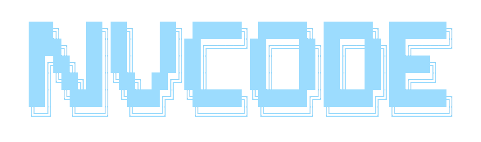

If you are looking for my old configs checkout the two snapshot branches
on this repo, there is one for CoC and one for Native LSP

## Install In One Command!

```bash
bash <(curl -s https://raw.githubusercontent.com/ChristianChiarulli/nvim/master/utils/installer/install.sh)
```

## Get the latest version of Neovim

``` bash
cd ~
sudo rm -r neovim
git clone https://github.com/neovim/neovim
cd neovim
sudo make CMAKE_BUILD_TYPE=Release install
cd ~
sudo rm -r neovim
```

## VSCode support

After installing the [Neovim
extension](https://github.com/asvetliakov/vscode-neovim) in VSCode

I recommend using this alongside the VSCode
[which-key](https://github.com/VSpaceCode/vscode-which-key) extension

You will also need `settings.json` and `keybindings.json` which can be
found in utils/vscode\_config

Point the nvim path to your `nvim` binary

Point your `init.vim` path to:

``` vim
$HOME/.config/nvim/vimscript/nv-vscode/init.vim
```

## Clipboard Support

- On Mac `pbcopy` should be built-in

- Ubuntu

    ```bash
    sudo apt install xsel
    ```

- Arch

    ```bash
    sudo pacman -S xsel
    ```

## LSP

To install a supported language server:

```
:LspInstall <your_language_server>
```

For a more in depth LSP support:
[link](https://github.com/neovim/nvim-lspconfig/blob/master/CONFIG.md)

## efm server is slow on close

Install the latest with:

``` bash
go get github.com/mattn/efm-langserver@HEAD
```

## Useful Programs

``` bash
ranger
ueberzug
fd
ripgrep
jq
fzf
lazygit
lazydocker
ncdu
pynvim
neovim-remote
```

## Formatters and Linters

**Python**

``` bash
pip3 install --user flake8
pip3 install --user yapf
```

**Lua**

``` bash
luarocks install --server=https://luarocks.org/dev luaformatter
```

**Yaml, Json, Javascript, HTML, CSS**

``` bash
npm install -g prettier
```

**Markdown**

``` bash
pandoc
```

## Vim Gists

To use vim-gists you will need to configure the following:

``` bash
git config --global github.user <username>
```

## Snippets

If you are looking for snippets checkout this github topic: [Snippet
Topic](https://github.com/topics/vscode-snippets)

## De-bugging

To set up your particular debugger, look here:
[link](https://github.com/mfussenegger/nvim-dap/wiki/Debug-Adapter-installation)

## TODO

**HIGH PRIORITY**

- better install script, simple install just support `~/.config/nvim`
  path
- add badges to readme

**LOW PRIORITY**

- move to ultisnips
- Implement what I can from this java config:
  [link](https://github.com/mfussenegger/nvim-jdtls/wiki/Sample-Configurations)
  - better ui for code actions - formatting
  - setup junit tests for java
- look into auto-install lsp
- json config file (luajson)
- get logo
- look into emmet-ls
- toggle virtual text diagnostics
- configure neogit
- list all binaries needed for functionality
- html snippets in react (maybe)
- configure kshenoy/vim-signature
- vim ult test
- what is `fzy`
- https://github.com/pwntester/octo.nvim
- configure surround

**PLUGIN BUGS**

- finding files from dashboard sometimes number not set
- better auto-import (jsx)
- keep and eye on indent guides plugin for thin lines
