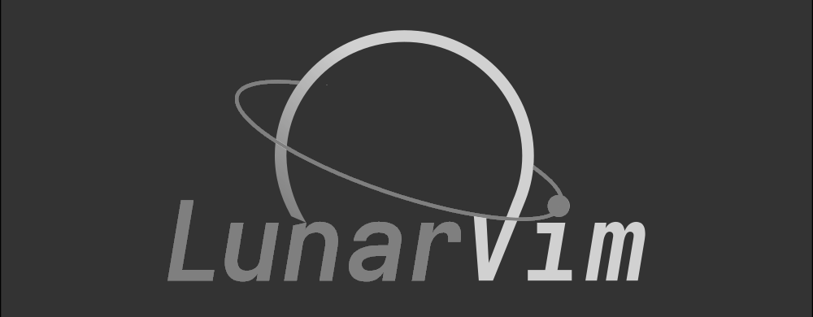
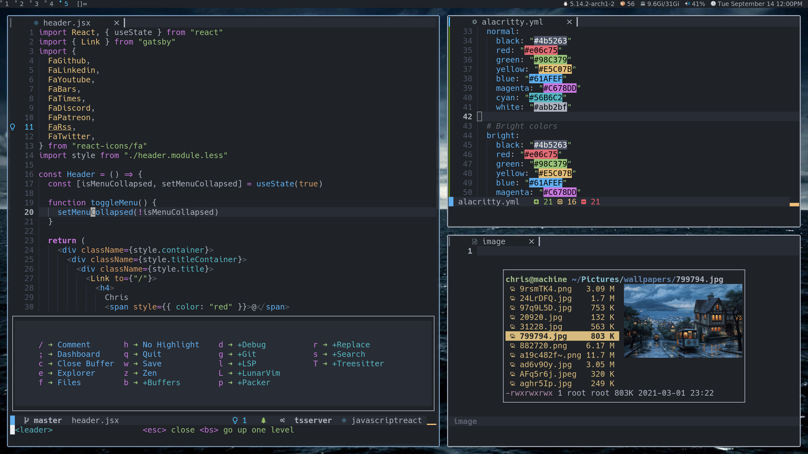
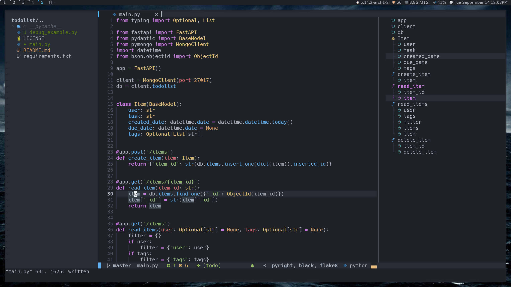

<div align="center"><p>
    <a href="https://github.com/lunarvim/LunarVim/releases/latest">
      
    </a>
    <a href="https://github.com/lunarvim/LunarVim/pulse">
      
    </a>
    <a href="https://github.com/lunarvim/LunarVim/blob/main/LICENSE">
      
    <a href="https://patreon.com/chrisatmachine" title="Donate to this project using Patreon">
      
    </a>
    <a href="https://twitter.com/intent/follow?screen_name=chrisatmachine">
      
    </a>
</p>

</div>

## Documentation

You can find all the documentation for LunarVim at [lunarvim.org](https://www.lunarvim.org)

## Install In One Command!

Make sure you have the release version of Neovim (0.6.1+).

Linux:
```bash
bash <(curl -s https://raw.githubusercontent.com/lunarvim/lunarvim/master/utils/installer/install.sh)
```

Windows (Powershell):
```powershell
Invoke-WebRequest https://raw.githubusercontent.com/LunarVim/LunarVim/master/utils/installer/install.ps1 -UseBasicParsing | Invoke-Expression
```

## Install Language support

- Enter `:LspInstall` followed by `<TAB>` to see your options for LSP

- Enter `:TSInstall` followed by `<TAB>` to see your options for syntax highlighting

**NOTE** I recommend installing `lua` for autocomplete in `config.lua`





## Configuration file

To install plugins configure LunarVim use the `config.lua` located here: `~/.config/lvim/config.lua`

Example:

```lua
-- general
lvim.format_on_save = true
lvim.colorscheme = "onedarker"

lvim.leader = "space"
-- add your own keymapping
lvim.keys.normal_mode["<C-s>"] = ":w<cr>"
-- unmap a default keymapping
-- lvim.keys.normal_mode["<C-Up>"] = ""
-- edit a default keymapping
-- lvim.keys.normal_mode["<C-q>"] = ":q<cr>"
-- set keymap with custom opts
-- lvim.keys.insert_mode["po"] = {'<ESC>', { noremap = true }}

-- Use which-key to add extra bindings with the leader-key prefix
-- lvim.builtin.which_key.mappings["P"] = { "<cmd>Telescope projects<CR>", "Projects" }

-- Configure builtin plugins
lvim.builtin.dashboard.active = true
lvim.builtin.notify.active = true
lvim.builtin.terminal.active = true

-- Treesitter parsers change this to a table of the languages you want i.e. {"java", "python", javascript}
lvim.builtin.treesitter.ensure_installed = "maintained"
lvim.builtin.treesitter.ignore_install = { "haskell" }

-- Disable virtual text
lvim.lsp.diagnostics.virtual_text = false

-- Select which servers should be configured manually. Requires `:LvimCacheRest` to take effect.
-- See the full default list `:lua print(vim.inspect(lvim.lsp.override))`
vim.list_extend(lvim.lsp.override, { "pyright" })

-- set a formatter, this will override the language server formatting capabilities (if it exists)
local formatters = require "lvim.lsp.null-ls.formatters"
formatters.setup {
  { command = "black" },
  {
    command = "prettier",
    ---@usage specify which filetypes to enable. By default a providers will attach to all the filetypes it supports.
    filetypes = { "typescript", "typescriptreact" },
  },
}

-- set additional linters
local linters = require "lvim.lsp.null-ls.linters"
linters.setup {
  { command = "black" },
  {
    command = "eslint_d",
    ---@usage specify which filetypes to enable. By default a providers will attach to all the filetypes it supports.
    filetypes = { "javascript", "javascriptreact" },
  },
}


-- Additional Plugins
lvim.plugins = {
    {"lunarvim/colorschemes"},
    {"folke/tokyonight.nvim"}, {
        "ray-x/lsp_signature.nvim",
        config = function() require"lsp_signature".on_attach() end,
        event = "BufRead"
    }
}
```

## Updating LunarVim

- inside LunarVim `:LvimUpdate`
- from the command-line `lvim +LvimUpdate +q`

### Update the plugins

- inside LunarVim `:PackerUpdate`

## Breaking changes

- `lvim.lang.FOO` is no longer supported. Refer to <https://www.lunarvim.org/languages> for up-to-date instructions.
- `lvim.lsp.popup_border` has been deprecated in favor of `lvim.lsp.float.border` and `lvim.lsp.diagnostics.float.border`.

## Resources

- [Documentation](https://www.lunarvim.org)

- [YouTube](https://www.youtube.com/channel/UCS97tchJDq17Qms3cux8wcA)

- [Discord](https://discord.gg/Xb9B4Ny)

- [Twitter](https://twitter.com/chrisatmachine)

## Testimonials

> "I have the processing power of a potato with 4 gb of ram and LunarVim runs perfectly."
>
> - @juanCortelezzi, LunarVim user.

> "My minimal config with a good amount less code than LunarVim loads 40ms slower. Time to switch."
>
> - @mvllow, Potential LunarVim user.

<div align="center" id="madewithlua">
	
[](#madewithlua)
	
</div>
