# Under the Hood

To properly render the flowcharts below, please install a browser extension for mermaid syntax

https://github.com/BackMarket/github-mermaid-extension
Google Chrome: [GitHub + Mermaid - Chrome Web Store](https://chrome.google.com/webstore/detail/github-%20-mermaid/goiiopgdnkogdbjmncgedmgpoajilohe)
Firefox: GitHub + Mermaid - [Firefox Add-ons](https://addons.mozilla.org/en-GB/firefox/addon/github-mermaid/)

# Logic from start to window load 

Last updated Wed Aug  4 10:04:27 PM CEST 2021

```mermaid
graph TD
  rtp[Set runtime path] --> config_check[Ensure user config exists]
  config_check -- lv-config.lua --> print_rename_message["Print a message asking user to rename file"]
  config_check -- config.lua --> load_defaults[Load default_config]
  print_rename_message --> load_defaults
  load_defaults --> load_lvim[Load lvim globals: builtin, lsp, diagnostics, misc]
  load_lvim --> load_lsp[Load lsp file]
  load_lsp --> load_common_on_attach( Load common_on_attach for use in lang configuration )
  load_common_on_attach --> load_common_capabilities( Load common_capabilities for use in lang configuration)
  load_common_capabilities --> load_common_on_init( Set common_on_init for use in lang configuration )
  load_common_on_init --> load_json[Load Json schemas]
  load_json --> load_lang[Load lvim globals: lang]
  load_lang --> load_keymappings[Load Keymappings data but don't set Keymappings]
  load_keymappings --> load_builtin_configs[Load configuration for builtin plugins]
  load_builtin_configs --> load_autocommands[Load autocommands but don't set them]
  load_autocommands --> set_default_options( Set the default options for the neovim editor )
  set_default_options --> load_user_config[Load user configuration file]
  load_user_config -- status ok --> set_nvim_settings[Set neovim settings]
  load_user_config -- status fail --> print_user_config_error["Print something is wrong with your config"]
  print_user_config_error --> set_nvim_settings
  set_nvim_settings --> define_autogroups[Define autogroups]
  define_autogroups --> setup_plugins[Setup Plugins]
  setup_plugins --> plugin_callback_check["Is there a callback set for lvim.builtin.<plugin>?"]
  plugin_callback_check -- Yes --> plugin_callback["Call the callback for the plugin"]
  plugin_callback_check -- No --> colorscheme[Set the colorscheme]
  plugin_callback --> colorscheme
  colorscheme --> autoformat[Is format on save enabled?]
  autoformat -- yes --> autoformat_active[Set an autocommand to enable autoformatting]
  autoformat -- no --> autoformat_disabled[Look for an autoformat autocommand and remove it if it exists]
  autoformat_active --> core_commands[Load core.commands: QuickFixToggle]
  autoformat_disabled --> core_commands
  core_commands --> lsp_handlers["Set up lsp handlers: publishDiagnostics, hover, signatureHelp"]
  lsp_handlers --> null-ls["Add null-ls as a language server in lspconfig"]
  null-ls --> nlsp["Set up NlspSettings"]
  nlsp --> set_keymappings["Apply default keymappings"]
  set_keymappings --> override_keymaps["Append to default keymappings"]
  override_keymaps --> setup_common_on_init["Setup common_on_init"]
  setup_common_on_init --> common_on_init_callback_check["Does a common on init callback exist?"]
  common_on_init_callback_check -- Yes --> common_on_init_callback["Call the callback"]
  common_on_init_callback_check -- No --> check_for_formatters["Check if formatters are explicitly set"]
  common_on_init_callback --> check_for_formatters
  check_for_formatters -- Yes --> turn_off_lsp_formatting["Turn off resolved_capabilities.document_formatting"]
  turn_off_lsp_formatting --> setup_common_on_attach["Setup common on attach"]
  setup_common_on_attach -- Has an lsp.on_attach_callback   --> call_lsp_on_attach_callback["Call lsp on_attach callback"]
  check_for_formatters -- No -->  setup_common_on_attach
  setup_common_on_attach -- No callback defined --> smart_cwd_check["Is lvim.lsp.smart_cwd set to true?"]
  smart_cwd_check -- True --> query_lsp_for_cwd["Use root directory from LSP"]
  smart_cwd_check -- False --> setup_null_ls["Setup null-ls formatters and linters"]
  setup_null_ls --> validate_provider_request["Does a valid provider exist?"]
  query_lsp_for_cwd --> setup_null_ls
  call_lsp_on_attach_callback --> smart_cwd_check
  validate_provider_request -- nil or empty provider --> first_window_load["First window load"]
  validate_provider_request -- Executable exists --> is_provider_eslint["Is provider eslint?"]
  is_provider_eslint -- Yes --> replace_with_eslintd["Replace it with eslint_d"]
  replace_with_eslintd -->  add_provider_to_table["Add it to the provider to a table"]
  is_provider_eslint -- No --> add_provider_to_table
  validate_provider_request -- Executable does not exist --> print_provider_error["Print error about not being able to find formatting executable"]
  add_provider_to_table --> first_window_load
  print_provider_error --> first_window_load
```

